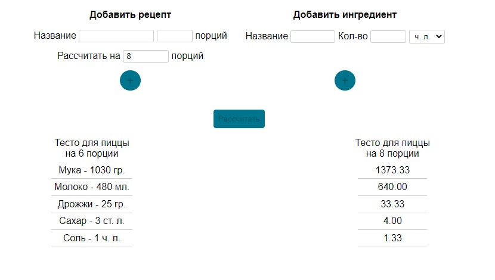

<h1 align="center">Калькулятор ингредиентов</h1>

<h2 align="center">Описание</h2>

Данный калькулятор позволяет расчитать сколько каждого ингредиента потребуется на определенное количество порций.

<h2 align="center">Как использовать</h2>

Для начала надо ввести название рецепта и изначальное количество порций.

Затем, в поле ниже, введите количество порций на которое необходимо рассчитывать ингредиенты.

Далее нажмите на кнопку +. Теперь можно приступать к добавлению ингредиентов.
В поле "Добавить ингредиент", введите название ингредиента, количество и меру веса. Нажмите +.

Можно добавить любое количество ингредиентов на ваше усмотрение.

После того, как все необходимые ингредиенты добавлены, нажмите кнопку "Рассчитать" и в списке ниже получите 
результат. 

<h2 align="center">Технологии</h2>

В этом проекте использовались:
* HTML
* CSS
* JavaScript

<h2 align="center">Дополнительно</h2>

Этот калькулятор создавался мной, прежде всего, как демо версия полноценного калькулятора для проекта cook-book.
В нем отсутствуют многие возможности, которые я хотела бы видеть в окончательной версии, но все они будут добавлены
в новый калькулятор в проекте cook-book. Но, тем не менее, даже такая простая вариация выполняет свою главную
функцию и хорошо помогает мне в повседневной жизни.

***

посмотреть и попользоваться можно [тут](https://natalielinen.github.io/ingredients-calculator/)
